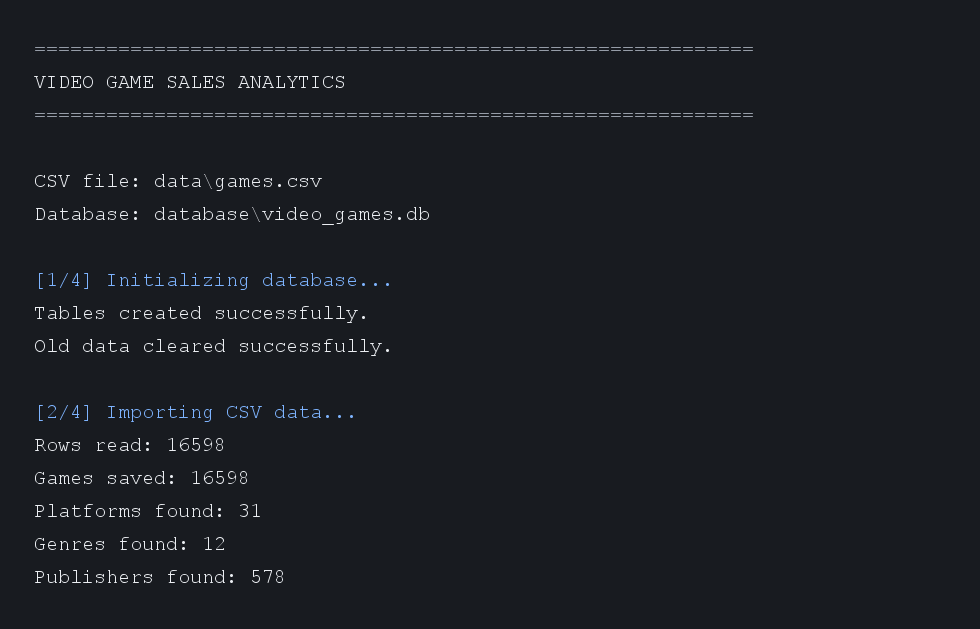
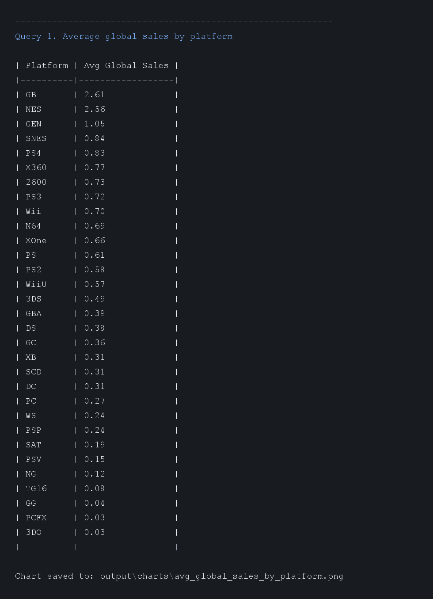
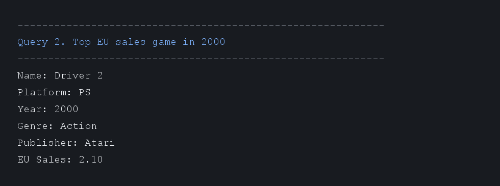
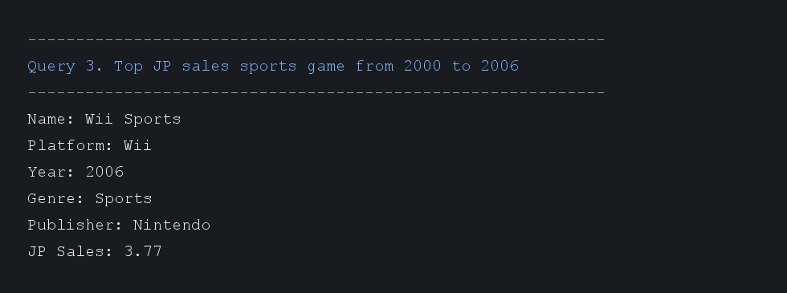

# Video Game Sales Analytics

## Описание проекта

`video-game-sales-analytics` — консольное Java-приложение для анализа продаж видеоигр из CSV-файла.

Приложение читает `games.csv`, создает SQLite-базу данных, импортирует данные в нормализованную схему, выполняет SQL-запросы по варианту и сохраняет PNG-график средних глобальных продаж по платформам.

## Цель работы

Цель проекта — пройти полный цикл обработки данных на Java:

- чтение CSV-файла;
- преобразование строк CSV в Java-объекты;
- проектирование SQLite-базы в 3НФ;
- импорт данных через JDBC;
- выполнение аналитических SQL-запросов;
- вывод результатов в консоль;
- построение PNG-графика;
- покрытие ключевой логики тестами.

## Вариант задания

Вариант 8 — Игры.

Задания:

1. Построить график по средним показателям глобальных продаж, объединив их по платформам.
2. Вывести игру с самым высоким показателем продаж в Европе за 2000 год.
3. Вывести спортивную игру 2000-2006 года с самым высоким показателем продаж в Японии.

## Используемый CSV-файл

Файл датасета:

```text
data/games.csv
```

Столбцы CSV:

```text
Rank,Name,Platform,Year,Genre,Publisher,NA_Sales,EU_Sales,JP_Sales,Other_Sales,Global_Sales
```

Особенности обработки:

- пустой `Year` сохраняется как `null`;
- год вида `2006.0` преобразуется в `2006`;
- пустой или `N/A` `Publisher` заменяется на `Unknown`;
- продажи читаются как `double`.

## Технологии

- Java 17;
- Maven;
- SQLite;
- JDBC;
- Apache Commons CSV;
- XChart;
- JUnit 5;
- Git и GitHub Pull Requests.

## Структура проекта

```text
video-game-sales-analytics/
├── data/
│   └── games.csv
├── database/
├── output/
│   └── charts/
├── screenshots/
│   ├── console/
│   └── charts/
├── src/
│   ├── main/
│   │   ├── java/ru/student/videogames/
│   │   │   ├── chart/
│   │   │   ├── config/
│   │   │   ├── db/
│   │   │   ├── dto/
│   │   │   ├── model/
│   │   │   ├── parser/
│   │   │   ├── repository/
│   │   │   ├── service/
│   │   │   ├── util/
│   │   │   └── Main.java
│   │   └── resources/
│   │       └── application.properties
│   └── test/
│       └── java/ru/student/videogames/
├── pom.xml
└── README.md
```

## Модель данных

В SQLite используется 5 таблиц:

- `platforms` — справочник платформ;
- `genres` — справочник жанров;
- `publishers` — справочник издателей;
- `games` — данные об игре;
- `sales` — показатели продаж.

## Нормализация до 3НФ

Схема нормализована до третьей нормальной формы:

- названия платформ вынесены в `platforms`;
- названия жанров вынесены в `genres`;
- названия издателей вынесены в `publishers`;
- таблица `games` хранит только данные игры и внешние ключи на справочники;
- таблица `sales` хранит только числовые показатели продаж и ссылку на игру;
- неключевые атрибуты зависят от ключа своей таблицы, а не от других неключевых полей.

## Схема базы данных

```sql
CREATE TABLE IF NOT EXISTS platforms (
    id INTEGER PRIMARY KEY AUTOINCREMENT,
    name TEXT NOT NULL UNIQUE
);

CREATE TABLE IF NOT EXISTS genres (
    id INTEGER PRIMARY KEY AUTOINCREMENT,
    name TEXT NOT NULL UNIQUE
);

CREATE TABLE IF NOT EXISTS publishers (
    id INTEGER PRIMARY KEY AUTOINCREMENT,
    name TEXT NOT NULL UNIQUE
);

CREATE TABLE IF NOT EXISTS games (
    id INTEGER PRIMARY KEY AUTOINCREMENT,
    "rank" INTEGER NOT NULL UNIQUE,
    name TEXT NOT NULL,
    platform_id INTEGER NOT NULL,
    release_year INTEGER,
    genre_id INTEGER NOT NULL,
    publisher_id INTEGER NOT NULL,

    FOREIGN KEY (platform_id) REFERENCES platforms(id),
    FOREIGN KEY (genre_id) REFERENCES genres(id),
    FOREIGN KEY (publisher_id) REFERENCES publishers(id)
);

CREATE TABLE IF NOT EXISTS sales (
    id INTEGER PRIMARY KEY AUTOINCREMENT,
    game_id INTEGER NOT NULL UNIQUE,
    na_sales REAL NOT NULL,
    eu_sales REAL NOT NULL,
    jp_sales REAL NOT NULL,
    other_sales REAL NOT NULL,
    global_sales REAL NOT NULL,

    FOREIGN KEY (game_id) REFERENCES games(id)
);
```

## SQL-запросы по варианту

### 1. Средние глобальные продажи по платформам

```sql
SELECT
    p.name AS platform,
    ROUND(AVG(s.global_sales), 2) AS avg_global_sales
FROM sales s
JOIN games g ON s.game_id = g.id
JOIN platforms p ON g.platform_id = p.id
GROUP BY p.name
ORDER BY avg_global_sales DESC;
```

Этот запрос также используется для построения графика.

### 2. Игра с максимальными продажами в Европе за 2000 год

```sql
SELECT
    g.name,
    p.name AS platform,
    g.release_year,
    ge.name AS genre,
    pub.name AS publisher,
    s.eu_sales
FROM sales s
JOIN games g ON s.game_id = g.id
JOIN platforms p ON g.platform_id = p.id
JOIN genres ge ON g.genre_id = ge.id
JOIN publishers pub ON g.publisher_id = pub.id
WHERE g.release_year = 2000
ORDER BY s.eu_sales DESC
LIMIT 1;
```

Ожидаемый результат:

```text
Driver 2 — EU Sales: 2.10
```

### 3. Спортивная игра 2000-2006 с максимальными продажами в Японии

```sql
SELECT
    g.name,
    p.name AS platform,
    g.release_year,
    ge.name AS genre,
    pub.name AS publisher,
    s.jp_sales
FROM sales s
JOIN games g ON s.game_id = g.id
JOIN platforms p ON g.platform_id = p.id
JOIN genres ge ON g.genre_id = ge.id
JOIN publishers pub ON g.publisher_id = pub.id
WHERE g.release_year BETWEEN 2000 AND 2006
  AND ge.name = 'Sports'
ORDER BY s.jp_sales DESC
LIMIT 1;
```

Ожидаемый результат:

```text
Wii Sports — JP Sales: 3.77
```

## Примеры вывода

```text
Video Game Sales Analytics
CSV file: data/games.csv
Database: database/video_games.db

Database initialized: database/video_games.db

Import summary
Rows read: 16598
Games saved: 16598
Duplicate games skipped: 0
Platforms found: 31
Genres found: 12
Publishers found: 578

Analytics results

------------------------------------------------------------
Query 1. Average global sales by platform
------------------------------------------------------------
| Platform | Avg Global Sales |
|----------|------------------|
| GB       | 2.61             |
| NES      | 2.56             |
| GEN      | 1.05             |

Chart saved to: output/charts/avg_global_sales_by_platform.png

------------------------------------------------------------
Query 2. Top EU sales game in 2000
------------------------------------------------------------
Name: Driver 2
Platform: PS
Year: 2000
Genre: Action
Publisher: Atari
EU Sales: 2.10

------------------------------------------------------------
Query 3. Top JP sales sports game from 2000 to 2006
------------------------------------------------------------
Name: Wii Sports
Platform: Wii
Year: 2006
Genre: Sports
Publisher: Nintendo
JP Sales: 3.77
```

## Диаграмма

## Скриншоты

### Импорт данных



### Средние глобальные продажи по платформам



### Игра с максимальными продажами в Европе за 2000 год



### Спортивная игра с максимальными продажами в Японии



## Как запустить

## Этапы разработки

## Вывод
